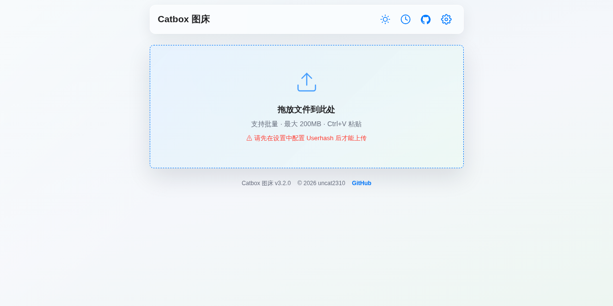
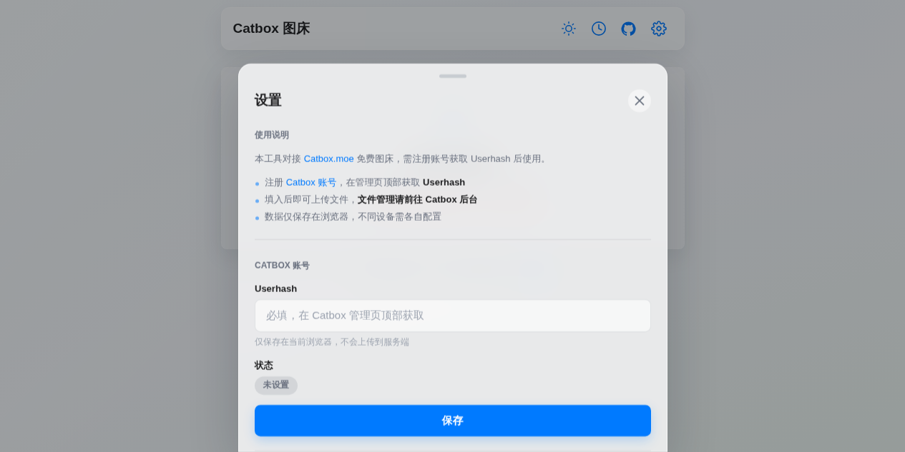
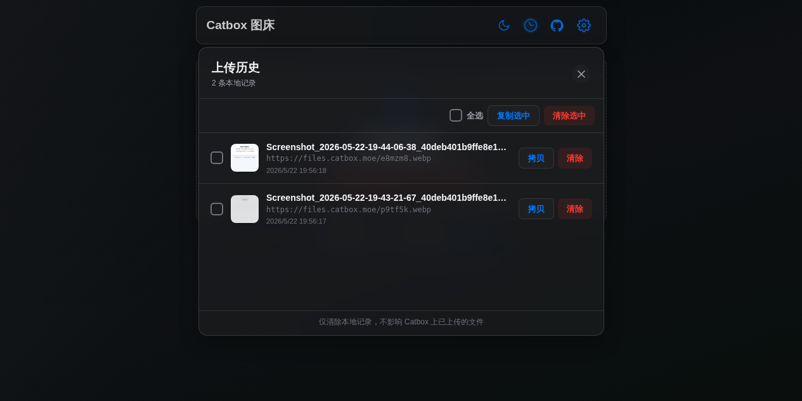

<div align="center">

# 📦 Catbox 图床 (Catbox Image Host)

**极简、轻量、高性能的 Catbox.moe 自建上传中枢与图床管理面板**

[](https://opensource.org/licenses/MIT)
[](https://www.python.org/)
[](https://www.docker.com/)
[](https://github.com/uncat2310/catbox-imagehost/actions)

*优雅托管，极速分发，一切尽在掌控。*

<br />



<p align="center">
  
  
</p>

</div>

---

## 📖 项目简介

**Catbox 图床 (Catbox Image Host)** 是一款专为 [Catbox.moe](https://catbox.moe) 打造的高颜值自建图床管理面板。后端基于异步高并发 **FastAPI** 框架，前端采用原生极简 **HTML5 / Vanilla CSS / JavaScript** 开发。

无需复杂依赖，支持批量并发上传、上传前客户端/服务端 WebP 智能压缩、本地历史持久化、AES-GCM 加密备份与多设备自适应布局。

---

## ✨ 核心特性

- 🍎 **Apple 极简设计规范**：精心打磨的毛玻璃拟态质感、细腻微交互与流体排版。
- 🌓 **双模主题智能切换**：支持浅色白与暗黑夜间模式，支持跟随操作系统偏好自动切换。
- ⚡ **多通道受控并发上传**：支持 1~6 线程并行上传图片、动图、音视频及各类通用文件。
- 🎯 **智能 WebP 图像无损压缩**：支持上传前实时转码 WebP 并自由调节压缩质量，大幅节省流量与存储。
- 🔒 **端到端隐私安全**：Catbox `userhash` 默认保存于浏览器本地存储，绝不泄露至公共环境。
- 📋 **富格式链接一键直达**：上传成功即时生成原始直链、Markdown 嵌入代码及 HTML 标签。
- 💾 **无感历史持久化与加密备份**：支持上传记录批量检索、导出导入与基于 Web Crypto 的 AES-GCM 端对端加密备份。
- 🐳 **多架构 Docker 秒级部署**：原生提供 `linux/amd64` 与 `linux/arm64` 多平台 Docker 镜像与 Docker Compose 编排。

---

## 🚀 快速开始

### 方式一：Docker 一键拉取运行（推荐，免环境配置）

只需一条 Docker 命令即可瞬时启动容器：

```bash
docker run -d \
  --name catbox-imagehost \
  --restart unless-stopped \
  -p 7800:7800 \
  -v ./catbox-data:/app/config \
  ghcr.io/uncat2310/catbox-imagehost:latest
```

启动后打开浏览器访问 `http://localhost:7800` 即可！

---

### 方式二：Docker Compose 编排

1. 克隆代码仓库：
```bash
git clone https://github.com/uncat2310/catbox-imagehost.git
cd catbox-imagehost
```

2. 一键启动容器：
```bash
docker compose up -d
```

3. 打开浏览器访问 `http://localhost:7800`。

---

### 方式三：Python 本地源码运行

#### 环境要求
- **Python**: 3.11 或更高版本

#### 步骤
```bash
git clone https://github.com/uncat2310/catbox-imagehost.git
cd catbox-imagehost

# 创建并激活虚拟环境
python3 -m venv venv
source venv/bin/activate  # Linux/macOS
# .\venv\Scripts\activate  # Windows

# 安装依赖
pip install -r backend/requirements.txt

# 初始化配置
cp config/settings.example.json config/settings.json

# 启动服务
./run.sh
```

---

## 🛠️ 项目结构

```text
catbox-imagehost/
├── backend/                 # FastAPI 后端服务
│   ├── main.py              # 服务入口与 API 路由
│   ├── catbox_client.py     # Catbox.moe 异步客户端
│   ├── config.py            # 配置管理与历史记录持久化
│   ├── image_processor.py   # Pillow 图像处理与 WebP 转码
│   └── requirements.txt     # Python 依赖清单
├── frontend/                # 原生极简前端界面
│   ├── index.html           # 应用骨架与元数据
│   ├── style.css            # 响应式毛玻璃设计系统
│   └── app.js               # 交互逻辑与并发上传引擎
├── config/                  # 运行配置模版
│   └── settings.example.json
├── Dockerfile               # 多阶段 Docker 构建文件
├── docker-compose.yml       # 容器编排文件
├── docker-entrypoint.sh     # 容器启动引导脚本
└── README.md
```

---

## ⚙️ 配置说明

服务端配置文件位于 `config/settings.json`（已加入 `.gitignore` 保护隐私），默认配置示例：

```json
{
  "webp_enabled": true,
  "webp_quality": 80,
  "upload_concurrency": 3,
  "theme": "auto",
  "history": []
}
```

| 参数项 | 类型 | 默认值 | 说明 |
| :--- | :--- | :--- | :--- |
| `webp_enabled` | Boolean | `true` | 是否默认开启 WebP 智能图像转码 |
| `webp_quality` | Integer | `80` | WebP 压缩质量（范围 1~100） |
| `upload_concurrency` | Integer | `3` | 并发上传线程数（范围 1~6） |
| `theme` | String | `auto` | 主题模式（`auto` 跟随系统 / `light` 浅色 / `dark` 深色） |
| `history` | Array | `[]` | 本地上传历史记录列表 |

---

## 🔌 API 接口规范

| 请求方法 | 路径 | 描述 |
| :--- | :--- | :--- |
| `GET` | `/` | 返回前端单页应用 |
| `GET` | `/api/health` | 服务健康检查接口 |
| `GET` | `/api/config` | 获取当前服务端配置 |
| `POST` | `/api/config` | 更新服务端配置参数 |
| `POST` | `/api/upload` | 上传文件并转发至 Catbox.moe |
| `GET` | `/api/history` | 查询本地上传历史 |
| `POST` | `/api/history/delete` | 批量删除本地历史记录 |
| `GET` | `/api/export` | 导出完整配置与加密历史 |
| `POST` | `/api/import` | 导入配置与恢复历史 |

---

## 🔒 安全与隐私准则

- **凭证隔离**：用户的 `userhash` 仅保存于客户端本地，不在服务端做任何明文持久化；
- **加密备份**：导出的历史数据支持通过 Web Crypto API 进行 AES-GCM 高强度加密；
- **公开托管注意**：上传的文件将托管于 Catbox.moe 公共服务器，请确保上传内容适宜公开分发。

---

## 📄 开源许可证

本项目基于 [MIT License](LICENSE) 协议开源。
